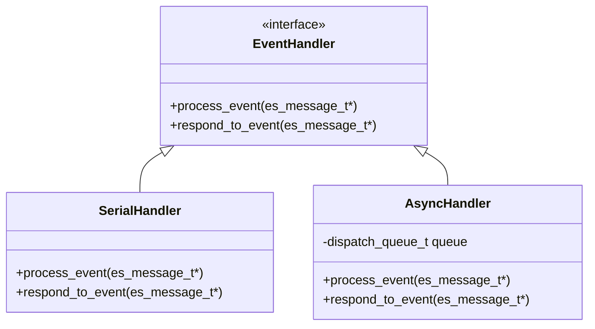

# API Reference

This document provides detailed information about the key functions, data structures, and APIs used in EndpointSecurityDemo.

## EndpointSecurity Framework Integration

### Client Initialization

```objectivec
es_new_client_result_t es_new_client(es_client_t **client, const es_handler_block_t handler);
```

Creates a new EndpointSecurity client and registers an event handler.

**Parameters:**
- `client`: Pointer to an es_client_t pointer that will be set to the new client
- `handler`: Block to be called when events are received

**Return Values:**
- `ES_NEW_CLIENT_RESULT_SUCCESS`: Client created successfully
- `ES_NEW_CLIENT_RESULT_ERR_NOT_ENTITLED`: Application lacks required entitlement
- `ES_NEW_CLIENT_RESULT_ERR_NOT_PERMITTED`: Application lacks TCC approval
- `ES_NEW_CLIENT_RESULT_ERR_NOT_PRIVILEGED`: Application not running as root

### Event Subscription

```objectivec
es_return_t es_subscribe(es_client_t *client, const es_event_type_t *events, uint32_t event_count);
```

Subscribes the client to the specified event types.

**Parameters:**
- `client`: The client to subscribe
- `events`: Array of event types to subscribe to
- `event_count`: Number of events in the array

**Return Values:**
- `ES_RETURN_SUCCESS`: Subscription successful
- `ES_RETURN_ERROR`: Subscription failed

## Event Handling System

### Event Handler Types

EndpointSecurityDemo implements two types of event handlers:



#### Serial Message Handler

```objectivec
es_handler_block_t serial_message_handler = ^(es_client_t *clt, const es_message_t *msg) {
    // Process events synchronously
};
```

Processes events in a serial fashion, one at a time.

#### Asynchronous Message Handler

```objectivec
es_handler_block_t asynchronous_message_handler = ^(es_client_t *clt, const es_message_t *msg) {
    // Process events asynchronously
};
```

Processes events concurrently, potentially improving performance for high-volume event streams.

### Authorization Response Functions

```objectivec
es_respond_result_t es_respond_auth_result(es_client_t *client, const es_message_t *message,
                                         es_auth_result_t result, bool cache);
```

Responds to authorization events with allow/deny decisions.

```objectivec
es_respond_result_t es_respond_flags_result(es_client_t *client, const es_message_t *message,
                                          uint32_t authorized_flags, bool cache);
```

Responds to open events with specific access flags.

## Security Feature APIs

### Gatekeeper Module

```objectivec
es_auth_result_t gatekeeper_auth_handler(const es_message_t *msg);
```

Handles authorization decisions based on Gatekeeper-like policies.

```objectivec
bool is_validly_signed(const es_process_t* proc, GatekeeperPolicyLevel policy_level);
```

Determines if a process is validly signed according to the specified policy level.

### XProtect Module

```objectivec
es_auth_result_t xprotect_auth_handler(const es_message_t *msg);
```

Handles authorization decisions based on XProtect-like malware detection.

```objectivec
ThreatLevel analyze_file_threat_level(const char* path);
```

Analyzes a file to determine its threat level (None, Suspicious, Malicious).

### Utility Functions

```objectivec
NSString* calculate_file_hash(const char* path);
```

Calculates the SHA-256 hash of a file.

```objectivec
bool is_file_quarantined(const char* path);
```

Checks if a file has the quarantine extended attribute.

```objectivec
void record_suspicious_behavior(const es_process_t* proc);
```

Records suspicious behavior for a process and tracks the count of such behaviors.

## Data Structures

### Message Structure

The `es_message_t` structure is provided by the EndpointSecurity framework and contains information about security events:

```
es_message_t
├── version: uint32_t
├── time: timespec
├── mach_time: uint64_t
├── deadline: uint64_t
├── seq_num: uint64_t (v2+)
├── global_seq_num: uint64_t (v4+)
├── process: es_process_t*
├── event_type: es_event_type_t
├── action_type: es_action_type_t
└── event: union { ... }
```

### Process Information

The `es_process_t` structure contains information about a process:

```
es_process_t
├── audit_token: audit_token_t
├── ppid: pid_t
├── original_ppid: pid_t
├── group_id: pid_t
├── session_id: pid_t
├── codesigning_flags: uint32_t
├── is_platform_binary: bool
├── is_es_client: bool
├── executable: es_file_t*
├── tty: es_file_t* (v2+)
├── start_time: timespec (v3+)
├── signing_id: es_string_token_t
├── team_id: es_string_token_t
└── cdhash: uint8_t[CS_CDHASH_LEN]
```

## Constants and Enumerations

### Policy Levels

```objectivec
typedef NS_ENUM(NSUInteger, GatekeeperPolicyLevel) {
    GatekeeperPolicyDisabled = 0,
    GatekeeperPolicyDeveloperIDSigned = 1,
    GatekeeperPolicyAppStoreOnly = 2
};
```

Defines the levels of Gatekeeper policy enforcement.

### Threat Levels

```objectivec
typedef NS_ENUM(NSUInteger, ThreatLevel) {
    ThreatLevelNone = 0,
    ThreatLevelSuspicious = 1,
    ThreatLevelMalicious = 2
};
```

Defines the threat levels used in malware detection.
