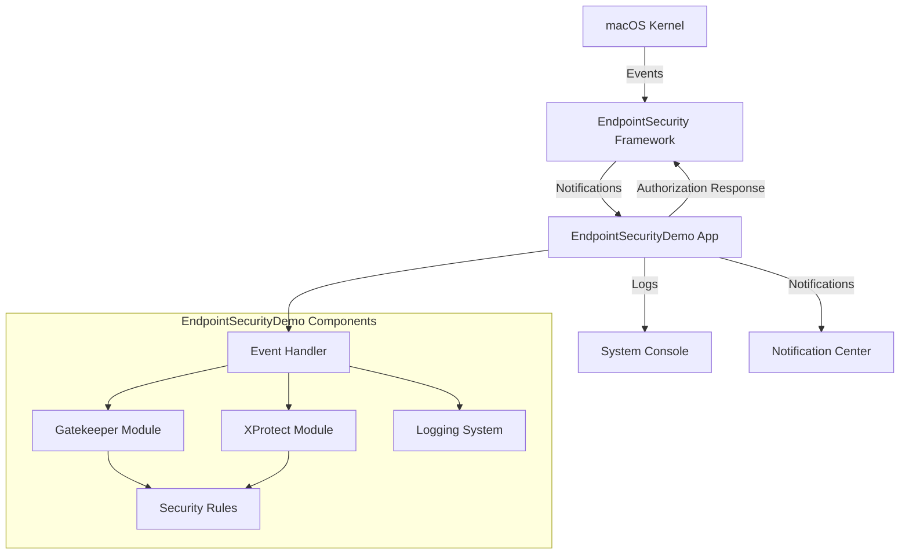
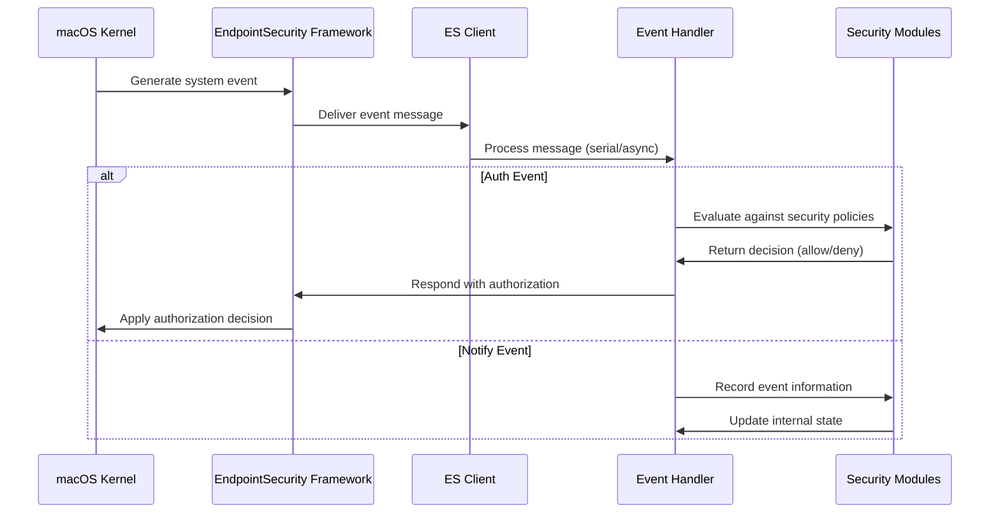
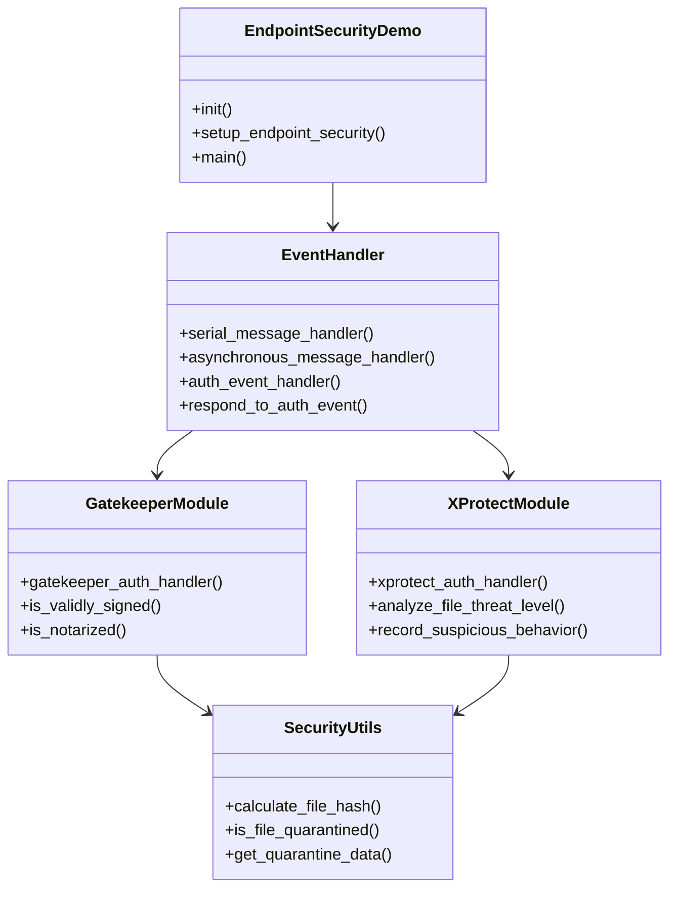
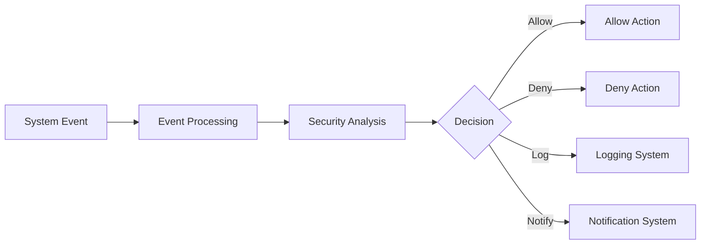

# Architecture Overview

EndpointSecurityDemo is built on Apple's EndpointSecurity framework, providing a comprehensive system for monitoring and controlling system events on macOS.

## High-Level Architecture

## Event Flow Sequence

## Component Architecture

The application is structured into several key components:

### 1. Event Handling System

Two modes of operation are supported:
- **Serial Message Handler**: Processes events one at a time in the order received
- **Asynchronous Message Handler**: Processes events concurrently for improved performance

### 2. Security Modules

### 3. Data Flow

## Technical Implementation

The application is implemented in Objective-C, leveraging the following key frameworks:

- **EndpointSecurity.framework**: Core framework for system event monitoring
- **libbsm.tbd**: For Audit Token functions
- **UniformTypeIdentifiers.framework**: For file type identification
- **Security.framework**: For cryptographic operations

Communication with the EndpointSecurity framework happens through a client connection established with `es_new_client()` and subscription to specific event types with `es_subscribe()`.
