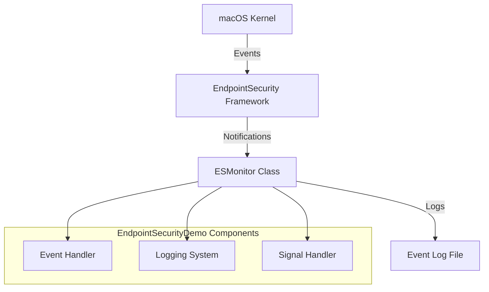
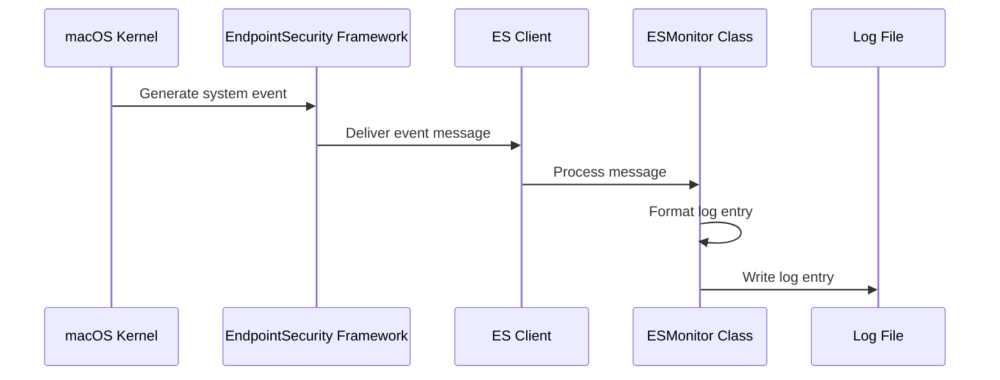
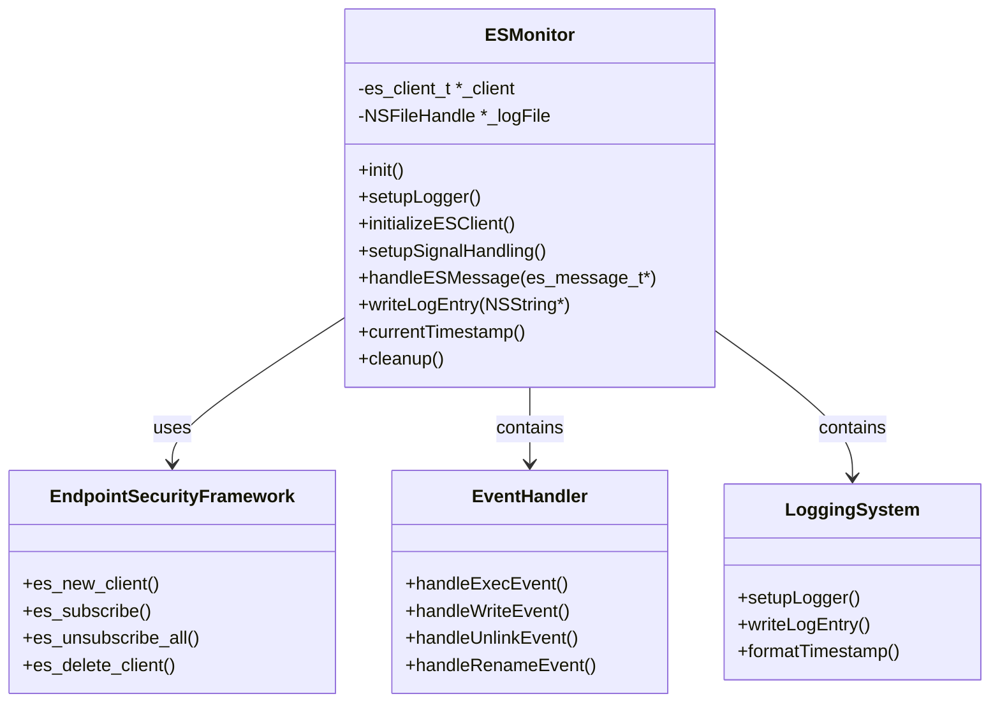
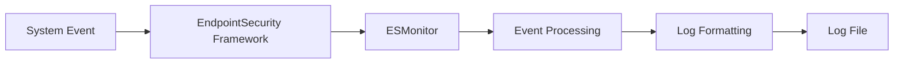

# Architecture Overview

EndpointSecurityDemo is built on Apple's EndpointSecurity framework, providing a comprehensive system for monitoring and controlling system events on macOS.

## High-Level Architecture

## Event Flow Sequence

## Component Architecture

The application is structured into several key components:

### 1. Core ESMonitor Class

The ESMonitor class serves as the central component that:
- Initializes the EndpointSecurity client
- Sets up the logging system
- Handles incoming events
- Manages cleanup on termination

### 2. Event Handling System

The application monitors four critical event types:
- **EXEC**: Process execution events
- **WRITE**: File write operations
- **UNLINK**: File deletion operations
- **RENAME**: File rename operations

### 3. Logging System

EndpointSecurityDemo implements a robust file-based logging system that:
- Creates a log file if it doesn't exist
- Formats entries with timestamps and process information
- Appends entries to the log file

### 4. Signal Handling

The application implements proper signal handling to ensure graceful termination:
- Intercepts SIGINT (Ctrl+C) signals
- Performs cleanup operations before termination
- Ensures all resources are properly released

## Data Flow

## Technical Implementation

The application is implemented in Objective-C, leveraging the following key frameworks:

- **EndpointSecurity.framework**: Core framework for system event monitoring
- **libbsm.tbd**: For Audit Token functions
- **Foundation.framework**: For core Objective-C functionality

Communication with the EndpointSecurity framework happens through a client connection established with `es_new_client()` and subscription to specific event types with `es_subscribe()`.
