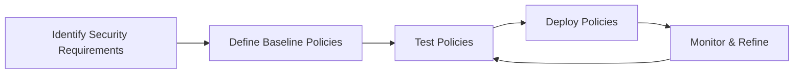
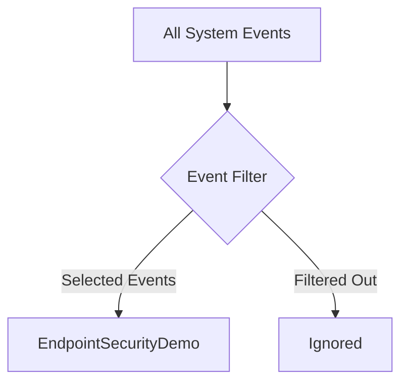
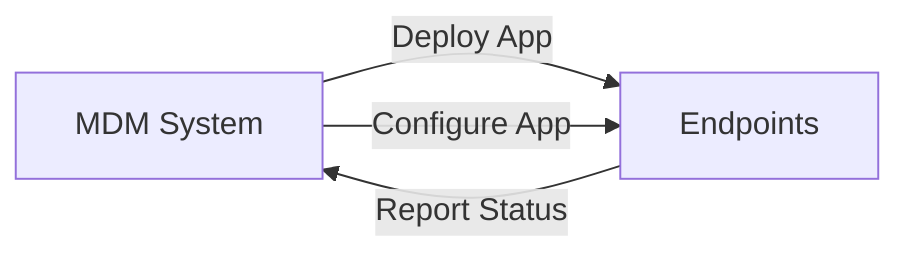

# Best Practices

This document outlines best practices for implementing and using EndpointSecurityDemo in a corporate environment, focusing on security, performance, and maintenance considerations.

## Security Configuration

### Policy Development



#### 1. Tiered Policy Approach

Implement a tiered approach to security policies:

- **Baseline Tier**: Applied to all systems
  - Block execution of known malicious applications
  - Monitor sensitive file access
  - Alert on suspicious behaviors

- **Enhanced Tier**: Applied to systems with sensitive data
  - Stricter code signing requirements
  - More comprehensive monitoring
  - Lower threshold for suspicious behavior alerts

- **Restricted Tier**: Applied to high-security systems
  - App Store only applications
  - Comprehensive file access controls
  - Immediate blocking of suspicious behavior

#### 2. Approved Application List

Maintain an approved application list:

```objectivec
// Example of configuring allowed applications
NSSet *g_allowed_applications = [NSSet setWithObjects:
    @"/Applications/ApprovedApp1.app/Contents/MacOS/ApprovedApp1",
    @"/Applications/ApprovedApp2.app/Contents/MacOS/ApprovedApp2",
    nil];
```

#### 3. Security Feature Selection

Select security features based on environmental requirements:

| Feature | Use Case | Performance Impact |
|---------|----------|-------------------|
| Serial Handler | Standard environments | Low |
| Async Handler | High-volume environments | Medium |
| Gatekeeper Mode | All environments | Medium |
| XProtect Mode | High-security environments | High |
| Verbose Logging | Debugging only | Very High |

## Performance Optimization

### Event Filtering



#### 1. Event Type Selection

Select only the event types that are necessary for your security requirements:

```objectivec
// Essential events for basic security monitoring
es_event_type_t essential_events[] = {
    ES_EVENT_TYPE_AUTH_EXEC,
    ES_EVENT_TYPE_AUTH_OPEN,
    ES_EVENT_TYPE_NOTIFY_FORK
};

// Additional events for enhanced security monitoring
es_event_type_t enhanced_events[] = {
    ES_EVENT_TYPE_NOTIFY_CREATE,
    ES_EVENT_TYPE_NOTIFY_WRITE,
    ES_EVENT_TYPE_NOTIFY_RENAME,
    ES_EVENT_TYPE_NOTIFY_UNLINK
};
```

#### 2. Path Muting

Implement path muting for high-volume event sources:

```objectivec
// Common paths that generate high-volume events
const char *high_volume_paths[] = {
    "/private/var/folders/",
    "/Library/Caches/",
    "/Users/*/Library/Caches/",
    "/tmp/"
};

for (int i = 0; i < sizeof(high_volume_paths)/sizeof(high_volume_paths[0]); i++) {
    mute_path(high_volume_paths[i]);
}
```

#### 3. Process Exclusions

Consider excluding certain system processes from monitoring:

```objectivec
// Check if process should be excluded from monitoring
bool should_exclude_process(const es_process_t *proc) {
    NSString *path = esstring_to_nsstring(proc->executable->path);

    // System processes that can be safely excluded
    NSArray *excluded_processes = @[
        @"/usr/libexec/fpsd",
        @"/usr/libexec/trustd",
        @"/System/Library/PrivateFrameworks/CalendarAgent.framework/Executables/CalendarAgent"
    ];

    return [excluded_processes containsObject:path];
}
```

## Operational Considerations

### Logging Strategy

Implement a tiered logging strategy:

1. **Critical Events**: Always logged and forwarded to SIEM
   - Security policy violations
   - Malware detections
   - Suspicious behavior above threshold

2. **Warning Events**: Logged locally, selectively forwarded
   - Suspicious behavior below threshold
   - Quarantined file executions
   - Policy exceptions

3. **Informational Events**: Logged locally only
   - Routine events
   - Policy applications
   - System status changes

```objectivec
typedef enum {
    LOG_LEVEL_DEBUG,
    LOG_LEVEL_INFO,
    LOG_LEVEL_WARNING,
    LOG_LEVEL_CRITICAL
} LogLevel;

void log_event(LogLevel level, NSString *message) {
    // Log locally
    switch(level) {
        case LOG_LEVEL_DEBUG:
            if(g_verbose_logging) {
                NSLog(@"DEBUG: %@", message);
            }
            break;
        case LOG_LEVEL_INFO:
            NSLog(@"INFO: %@", message);
            break;
        case LOG_LEVEL_WARNING:
            NSLog(@"WARNING: %@", message);
            break;
        case LOG_LEVEL_CRITICAL:
            NSLog(@"CRITICAL: %@", message);
            break;
    }

    // Forward to SIEM if appropriate
    if(level >= LOG_LEVEL_WARNING) {
        forward_to_siem(level, message);
    }
}
```

### Maintenance Procedures

#### 1. Regular Updates

Implement a regular update schedule:

- **Weekly**: Update suspicious file extensions list
- **Bi-weekly**: Update malicious hash database
- **Monthly**: Review and refine security policies
- **Quarterly**: Update application version

#### 2. Health Checks

Perform regular health checks:

```bash
# Check if EndpointSecurityDemo is running
if pgrep -q EndpointSecurityDemo; then
    echo "EndpointSecurityDemo is running"
else
    echo "EndpointSecurityDemo is not running"
    # Restart procedure
    sudo launchctl load /Library/LaunchDaemons/com.organization.endpointsecuritydemo.plist
fi

# Check log output for errors
errors=$(grep -c "ERROR" /var/log/endpointsecuritydemo.log)
if [ $errors -gt 0 ]; then
    echo "Found $errors errors in log"
fi

# Check event drop rate
drops=$(grep -c "EVENTS DROPPED" /var/log/endpointsecuritydemo.log)
if [ $drops -gt 10 ]; then
    echo "High event drop rate detected: $drops"
fi
```

#### 3. Troubleshooting Procedures

Establish standard troubleshooting procedures:

1. **Collect Diagnostics**
   ```bash
   # Create diagnostic archive
   mkdir -p /tmp/esdiag
   cp /var/log/endpointsecuritydemo.* /tmp/esdiag/
   sudo codesign -dvvv /Applications/EndpointSecurityDemo.app > /tmp/esdiag/codesign.txt
   sudo system_profiler SPSoftwareDataType > /tmp/esdiag/system.txt
   tar -czf esdiag.tar.gz -C /tmp esdiag
   ```

2. **Restart Service**
   ```bash
   sudo launchctl unload /Library/LaunchDaemons/com.organization.endpointsecuritydemo.plist
   sudo launchctl load /Library/LaunchDaemons/com.organization.endpointsecuritydemo.plist
   ```

3. **Reset to Default Configuration**
   ```bash
   sudo defaults delete com.organization.endpointsecuritydemo
   sudo launchctl unload /Library/LaunchDaemons/com.organization.endpointsecuritydemo.plist
   sudo launchctl load /Library/LaunchDaemons/com.organization.endpointsecuritydemo.plist
   ```

## Integration Best Practices

### MDM Integration



1. **Configuration Profiles**
   - Use MDM to deliver and update configuration profiles
   - Use custom settings payload for application-specific configurations
   - Implement configuration verification and reporting

2. **Compliance Checking**
   - Create smart groups based on EndpointSecurityDemo status
   - Automate compliance reporting
   - Implement remediation workflows for non-compliant devices

### SIEM Integration

1. **Event Forwarding**
   - Use a consistent event format for SIEM integration
   - Include essential fields in all events:
     - Event type
     - Severity
     - Process information
     - File information
     - Action taken
     - Timestamp

2. **Alert Correlation**
   - Correlate EndpointSecurityDemo alerts with other security telemetry
   - Create composite alerts for suspicious patterns
   - Implement automated response workflows

## Team Training

### Security Team Training

Ensure security teams understand:

1. How to interpret EndpointSecurityDemo alerts
2. How to investigate triggered events
3. How to tune policies to reduce false positives
4. How to respond to different types of security events

### End-User Communication

Prepare communication templates for end-users:

1. **Alert Notification**: Explaining what the alert means and what action is required
2. **Block Notification**: Explaining why an action was blocked and how to request an exception
3. **Exception Request**: Process for requesting security policy exceptions

## Metrics and KPIs

Track the following metrics to evaluate the effectiveness of your deployment:

1. **Security Metrics**
   - Number of security events detected
   - Number of malicious files blocked
   - Average time to respond to security events
   - False positive rate

2. **Performance Metrics**
   - CPU usage
   - Memory usage
   - Event processing rate
   - Event drop rate

3. **Operational Metrics**
   - Deployment coverage
   - Configuration compliance
   - Exception request volume and resolution time
   - Update compliance
