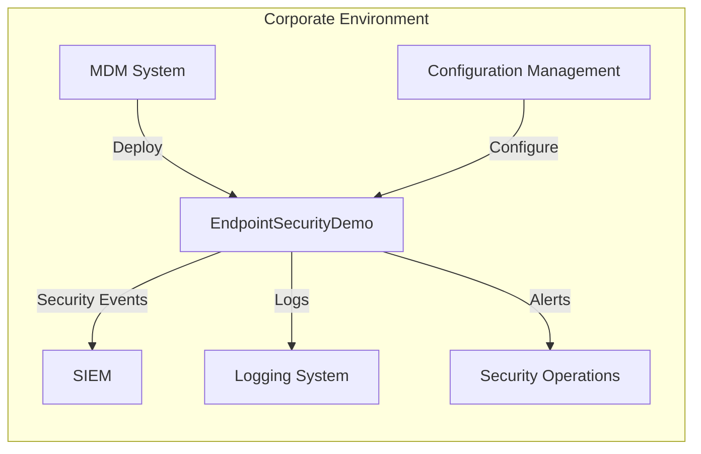
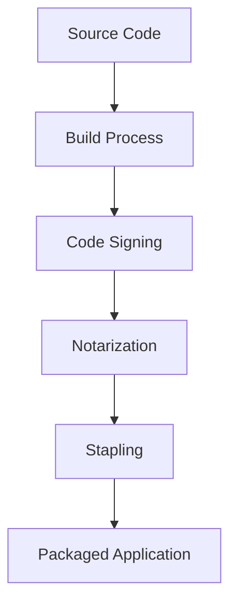

# Corporate Deployment Guide

This guide provides instructions for deploying EndpointSecurityDemo in a corporate environment, including integration with enterprise security systems, fleet management, and compliance considerations.

## Deployment Architecture



## Deployment Prerequisites

Before deploying EndpointSecurityDemo across your organization, ensure you have:

1. **Apple Developer Enterprise Program membership**
   - Required to obtain the endpoint security entitlement
   - Necessary for signing the application with your organization's certificate

2. **EndpointSecurity Entitlement**
   - Approved request for the `com.apple.developer.endpoint-security.client` entitlement
   - Provisioning profile that includes this entitlement

3. **Management Infrastructure**
   - Mobile Device Management (MDM) solution for deployment
   - Configuration management system for policy distribution
   - SIEM solution for event aggregation and analysis

4. **Testing Environment**
   - Representative sample of device models used in your organization
   - Test suite covering expected application behavior

## Deployment Workflow

### 1. Build and Sign



1. **Build the Application**
   - Follow the [[Setup Guide]] for building instructions
   - Use release configuration for production builds

2. **Code Sign with Enterprise Certificate**
   ```bash
   codesign --force --options runtime --sign "Developer ID Application: Your Organization (TEAMID)" --entitlements path/to/entitlements.plist path/to/EndpointSecurityDemo.app
   ```

3. **Notarize the Application**
   ```bash
   xcrun notarytool submit EndpointSecurityDemo.app.zip --apple-id "your@email.com" --password "app-specific-password" --team-id "TEAMID"
   ```

4. **Staple the Ticket**
   ```bash
   xcrun stapler staple EndpointSecurityDemo.app
   ```

### 2. Package for Deployment

Create a deployable package that includes:

1. The signed application bundle
2. Installation scripts
3. Configuration profiles

**Example packaging with `pkgbuild`:**
```bash
pkgbuild --root ./build --identifier com.yourorganization.endpointsecuritydemo --version 1.0 EndpointSecurityDemo.pkg
```

### 3. Define Deployment Configurations

Create configuration profiles for different organizational units:

```xml
<?xml version="1.0" encoding="UTF-8"?>
<!DOCTYPE plist PUBLIC "-//Apple//DTD PLIST 1.0//EN" "http://www.apple.com/DTDs/PropertyList-1.0.dtd">
<plist version="1.0">
<dict>
    <key>BlockedPaths</key>
    <array>
        <string>/Applications/UnapprovedApp1.app/Contents/MacOS/UnapprovedApp1</string>
        <string>/Applications/UnapprovedApp2.app/Contents/MacOS/UnapprovedApp2</string>
    </array>
    <key>MonitoringLevel</key>
    <string>Standard</string>
    <key>EnableXProtect</key>
    <true/>
    <key>EnableGatekeeper</key>
    <true/>
    <key>NotificationLevel</key>
    <string>Critical</string>
</dict>
</plist>
```

### 4. Deploy via MDM

Use your organization's MDM solution to deploy:

1. The application package
2. Configuration profiles
3. Terminal Full Disk Access policy
4. LaunchDaemon for automatic startup

**Example LaunchDaemon plist:**
```xml
<?xml version="1.0" encoding="UTF-8"?>
<!DOCTYPE plist PUBLIC "-//Apple//DTD PLIST 1.0//EN" "http://www.apple.com/DTDs/PropertyList-1.0.dtd">
<plist version="1.0">
<dict>
    <key>Label</key>
    <string>com.yourorganization.endpointsecuritydemo</string>
    <key>ProgramArguments</key>
    <array>
        <string>/Applications/EndpointSecurityDemo.app/Contents/MacOS/EndpointSecurityDemo</string>
        <string>gatekeeper</string>
        <string>xprotect</string>
    </array>
    <key>RunAtLoad</key>
    <true/>
    <key>KeepAlive</key>
    <true/>
    <key>StandardOutPath</key>
    <string>/var/log/endpointsecuritydemo.log</string>
    <key>StandardErrorPath</key>
    <string>/var/log/endpointsecuritydemo.err</string>
</dict>
</plist>
```

## SIEM Integration

EndpointSecurityDemo can be integrated with your SIEM solution by:

1. **Configuring Log Forwarding**
   - Forward logs to your centralized logging system
   - Use a log shipper like Filebeat or Fluentd

2. **Creating Custom Parsers**
   - Define parsers for EndpointSecurityDemo log format
   - Extract key fields for analysis

3. **Establishing Alert Rules**
   - Create SIEM alert rules based on security events
   - Define escalation paths for critical security events

**Example log forwarding configuration (Filebeat):**
```yaml
filebeat.inputs:
- type: log
  enabled: true
  paths:
    - /var/log/endpointsecuritydemo.log
  fields:
    source: endpoint_security_demo
    environment: production
```

## Monitoring and Maintenance

### Health Monitoring

Monitor the health of the EndpointSecurityDemo deployment:

1. **Process Monitoring**
   - Ensure the process is running on all endpoints
   - Set up alerts for unexpected terminations

2. **Performance Monitoring**
   - Monitor CPU and memory usage
   - Watch for high event volumes or dropped events

3. **Log Volume Monitoring**
   - Track log volume trends
   - Alert on unusual patterns

### Signature Updates

Implement a process for updating malware signatures:

1. **Signature Distribution**
   - Package updated signatures
   - Distribute via MDM

2. **Update Verification**
   - Verify signature updates are applied
   - Test detection capabilities

## Compliance Reporting

Generate reports for compliance purposes:

1. **Detection Reports**
   - Summary of security events
   - Trends and patterns

2. **Remediation Reports**
   - Actions taken on security events
   - Time to remediation metrics

3. **Coverage Reports**
   - Deployment status across the organization
   - Policy compliance statistics

## Rollback Procedure

In case issues arise, implement a rollback procedure:

1. **Stop the Service**
   ```bash
   sudo launchctl unload /Library/LaunchDaemons/com.yourorganization.endpointsecuritydemo.plist
   ```

2. **Remove Configuration**
   - Use MDM to remove configuration profiles

3. **Uninstall Application**
   - Use MDM to uninstall the application package

4. **Verify Removal**
   - Confirm the application and its components are removed
   - Check for any lingering processes or files
