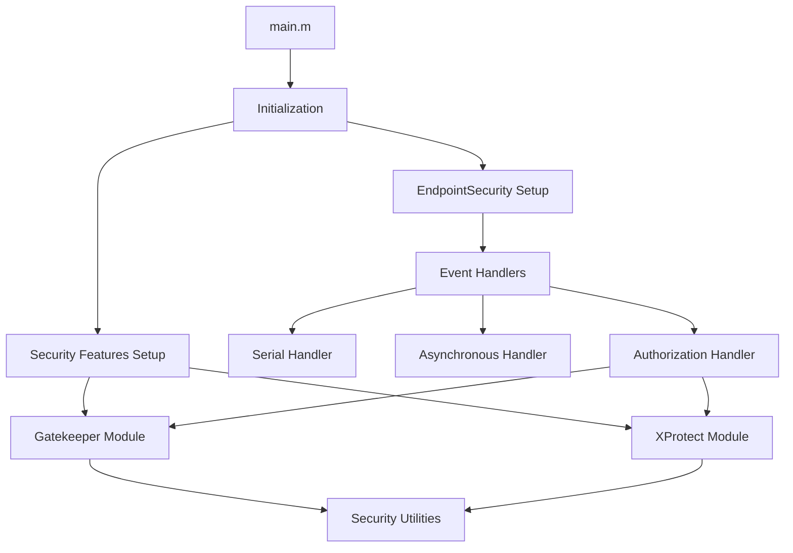

# Implementation Details

This document provides a comprehensive overview of the EndpointSecurityDemo implementation, focusing on key components, code organization, and internal operations.

## Codebase Organization

The EndpointSecurityDemo application is implemented primarily in Objective-C and leverages Apple's EndpointSecurity framework. The codebase is organized into several logical sections:



## Key Components

### 1. Initialization System

The application begins in the `main()` function, which performs the following steps:

```objectivec
int main(int argc, const char * argv[]) {
    signal(SIGINT, &sig_handler);

    @autoreleasepool {
        // Init global vars
        g_handler = get_message_handler_from_commandline_args(argc, argv);

        // Initialize date formatter and other tracking collections
        init_date_formater();
        g_seq_nums = [NSMutableDictionary new];

        // Initialize security features if we're in security mode
        if (g_gatekeeper_mode || g_xprotect_mode) {
            init_security_features();
        }

        // List of paths to be blocked
        g_blocked_paths = [NSSet setWithObjects: /* paths */ nil];

        if(!setup_endpoint_security()) {
            return 1;
        }

        // Start handling events from Endpoint Security
        dispatch_main();
    }

    return 0;
}
```

### 2. EndpointSecurity Client Setup

The `setup_endpoint_security()` function creates and configures the EndpointSecurity client:

```objectivec
bool setup_endpoint_security(void) {
    // Create a new client with an associated event message handler
    es_new_client_result_t res = es_new_client(&g_client, g_handler);

    // Clear cache of previous results
    es_clear_cache_result_t resCache = es_clear_cache(g_client);

    // Build a list of events to subscribe to
    NSMutableArray *eventsList = [NSMutableArray arrayWithObjects: /* event types */ nil];

    // Subscribe to the events we're interested in
    es_return_t subscribed = es_subscribe(g_client, events, sizeof events / sizeof *events);

    return log_subscribed_events();
}
```

### 3. Event Handling

The application implements two event handlers:

#### Serial Message Handler

```objectivec
es_handler_block_t serial_message_handler = ^(es_client_t *clt, const es_message_t *msg) {
    LOG_VERBOSE_EVENT_MESSAGE(msg);
    detect_and_log_dropped_events(msg);

    if(ES_ACTION_TYPE_AUTH == msg->action_type) {
        respond_to_auth_event(clt, msg, auth_event_handler(msg));
    }
};
```

#### Asynchronous Message Handler

```objectivec
es_handler_block_t asynchronous_message_handler = ^(es_client_t *clt, const es_message_t *msg) {
    LOG_VERBOSE_EVENT_MESSAGE(msg);
    detect_and_log_dropped_events(msg);

    es_message_t *copied_msg = copy_message(msg);

    if(ES_ACTION_TYPE_AUTH == copied_msg->action_type) {
        dispatch_async(dispatch_get_global_queue(DISPATCH_QUEUE_PRIORITY_BACKGROUND, 0), ^(void){
            es_auth_result_t result = auth_event_handler(copied_msg);
            respond_to_auth_event(clt, copied_msg, result);
            free_message(copied_msg);
        });
        return;
    }

    free_message(copied_msg);
};
```

## Security Features Implementation

### Gatekeeper Module

The Gatekeeper functionality is implemented through the following key functions:

```objectivec
// Check if a process is validly signed according to Gatekeeper policy
bool is_validly_signed(const es_process_t* proc, GatekeeperPolicyLevel policy_level) {
    // Code signature verification logic
}

// Check if an app has been notarized
bool is_notarized(const es_process_t* proc) {
    return (proc->codesigning_flags & CS_RUNTIME) == CS_RUNTIME;
}

// Enhanced handler for Gatekeeper-style checks
es_auth_result_t gatekeeper_auth_handler(const es_message_t *msg) {
    // Authorization decision logic based on Gatekeeper policies
}
```

### XProtect Module

The XProtect functionality is implemented through these key functions:

```objectivec
// Check if a file might be malware based on content analysis
ThreatLevel analyze_file_threat_level(const char* path) {
    // Malware detection logic
}

// Record suspicious behavior
void record_suspicious_behavior(const es_process_t* proc) {
    // Behavior tracking logic
}

// Enhanced handler for XProtect-style malware detection
es_auth_result_t xprotect_auth_handler(const es_message_t *msg) {
    // Malware prevention logic
}
```

## Performance Considerations

### Event Handling Efficiency

To maintain system performance, the application implements several optimization strategies:

1. **Event Filtering**: Subscribes only to necessary event types
2. **Path Muting**: Mutes high-volume paths to reduce event processing load
3. **Asynchronous Processing**: Offers an asynchronous handler for high-volume environments
4. **Caching**: Options for caching authorization responses

```objectivec
// Mute high-volume paths
bool mute_path(const char* path) {
    if(@available(macOS 12.0, *)) {
        result = es_mute_path(g_client, path, ES_MUTE_PATH_TYPE_LITERAL);
    } else {
        result = es_mute_path_literal(g_client, path);
    }
}
```

### Memory Management

The application carefully manages memory, especially for event messages:

```objectivec
// On macOS Big Sur 11+, Apple have deprecated es_copy_message in favour of es_retain_message
es_message_t * copy_message(const es_message_t * msg) {
    if(@available(macOS 11.0, *)) {
        es_retain_message(msg);
        return (es_message_t*) msg;
    } else {
        return es_copy_message(msg);
    }
}

// On macOS Big Sur 11+, Apple have deprecated es_free_message in favour of es_release_message
void free_message(es_message_t * _Nonnull msg) {
    if(@available(macOS 11.0, *)) {
        es_release_message(msg);
    } else {
        es_free_message(msg);
    }
}
```

## Cross-Platform Compatibility

The application is designed to work across multiple macOS versions, with conditional code that adapts to API changes:

```objectivec
// Example of version-specific code
if(@available(macOS 12.0, *)) {
    // Use macOS 12+ APIs
    log_muted_paths_events();
} else {
    // Use legacy APIs
    mute_path("/usr/sbin/cfprefsd");
}
```

## Logging and Telemetry

The application implements a comprehensive logging system:

```objectivec
#define LOG_IMPORTANT_INFO(fmt, ...) NSLog(@"*** " fmt @" ***", ##__VA_ARGS__)
#define LOG_INFO(fmt, ...) NSLog(@"%*s" fmt, g_log_indent, "", ##__VA_ARGS__)
#define LOG_ERROR(fmt, ...) NSLog(@"ERROR: " fmt, ##__VA_ARGS__)
#define LOG_SECURITY(fmt, ...) NSLog(@"SECURITY: " fmt, ##__VA_ARGS__)
```

## Security Notification System

The application implements a notification system to alert users to security events:

```objectivec
void send_security_notification(NSString *title, NSString *message, bool is_critical) {
    dispatch_async(g_notification_queue, ^{
        NSUserNotification *notification = [[NSUserNotification alloc] init];
        notification.title = title;
        notification.informativeText = message;
        notification.soundName = is_critical ? NSUserNotificationDefaultSoundName : nil;

        [[NSUserNotificationCenter defaultUserNotificationCenter] deliverNotification:notification];

        LOG_IMPORTANT_INFO("SECURITY ALERT: %@ - %@", title, message);
    });
}
```
