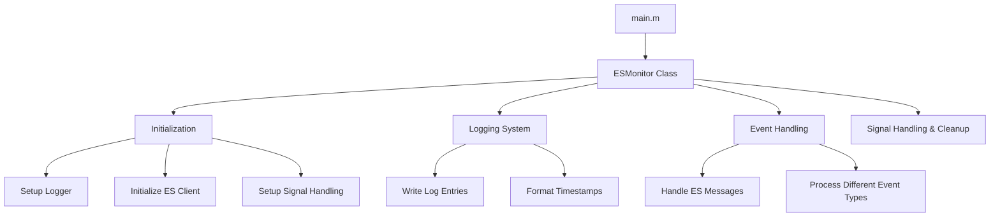

# Implementation Details

This document provides a comprehensive overview of the EndpointSecurityDemo implementation, focusing on key components, code organization, and internal operations.

## Codebase Organization

The EndpointSecurityDemo application is implemented primarily in Objective-C and leverages Apple's EndpointSecurity framework. The application uses a class-based architecture centered around the ESMonitor class:



## Key Components

### 1. ESMonitor Class

The core of the application is the `ESMonitor` class which handles EndpointSecurity events and logging:

```objectivec
@interface ESMonitor : NSObject {
@private
    es_client_t *_client;
    NSFileHandle *_logFile;
}

- (void)setupLogger;
- (void)initializeESClient;
- (void)setupSignalHandling;
- (void)handleESMessage:(const es_message_t *)message;
- (void)writeLogEntry:(NSString *)entry;
- (void)cleanup;
- (NSString *)currentTimestamp;
@end
```

### 2. Initialization System

The application initializes the ESMonitor in the `main()` function:

```objectivec
int main(int argc, const char * argv[]) {
    @autoreleasepool {
        NSLog(@"[INFO] Starting EndpointSecurity monitor…");
        __unused ESMonitor *mon = [[ESMonitor alloc] init];
        dispatch_main();
    }
    return EXIT_SUCCESS;
}
```

The ESMonitor initialization performs several key setup tasks:

```objectivec
- (instancetype)init {
    self = [super init];
    if (self) {
        [self setupLogger];
        [self initializeESClient];
        [self setupSignalHandling];
    }
    return self;
}
```

### 3. EndpointSecurity Client Setup

The `initializeESClient` method creates and configures the EndpointSecurity client:

```objectivec
- (void)initializeESClient {
    es_new_client_result_t res = es_new_client(&_client, ^(es_client_t *client, const es_message_t *msg) {
        [self handleESMessage:msg];
    });

    // Subscribe to specific events
    es_event_type_t evts[] = {
        ES_EVENT_TYPE_NOTIFY_EXEC,
        ES_EVENT_TYPE_NOTIFY_WRITE,
        ES_EVENT_TYPE_NOTIFY_UNLINK,
        ES_EVENT_TYPE_NOTIFY_RENAME
    };
    es_return_t sub = es_subscribe(_client, evts, sizeof(evts)/sizeof(evts[0]));
}
```

### 4. Event Handling

The application handles EndpointSecurity events through the `handleESMessage` method:

```objectivec
- (void)handleESMessage:(const es_message_t *)message {
    pid_t pid = audit_token_to_pid(message->process->audit_token);
    NSString *entry = nil;

    // Process different event types: EXEC, WRITE, UNLINK, RENAME
    switch (message->event_type) {
        case ES_EVENT_TYPE_NOTIFY_EXEC:
            // Handle process execution events
            break;

        case ES_EVENT_TYPE_NOTIFY_WRITE:
            // Handle file write events
            break;

        // Other event types...
    }

    // Log the event if applicable
    if (entry) {
        [self writeLogEntry:entry];
    }
}
```

## Logging System

The application implements a file-based logging system:

### 1. Logger Setup

```objectivec
- (void)setupLogger {
    NSFileManager *fm = [NSFileManager defaultManager];
    NSString *logPath = @"/var/log/es_monitor.log";

    // Create log file if it doesn't exist
    if (![fm fileExistsAtPath:logPath]) {
        BOOL ok = [fm createFileAtPath:logPath
                              contents:nil
                            attributes:@{ NSFilePosixPermissions:@0644 }];
    }

    // Open log file for writing
    NSError *err = nil;
    _logFile = [NSFileHandle fileHandleForWritingToURL:[NSURL fileURLWithPath:logPath]
                                                error:&err];
    [_logFile seekToEndOfFile];
}
```

### 2. Log Entry Writing

```objectivec
- (void)writeLogEntry:(NSString *)entry {
    NSData *d = [[entry stringByAppendingString:@"\n"] dataUsingEncoding:NSUTF8StringEncoding];
    @try {
        [_logFile writeData:d];
    } @catch (NSException *ex) {
        NSLog(@"[ERROR] Log write failed: %@", ex.reason);
    }
}
```

### 3. Timestamp Formatting

```objectivec
- (NSString *)currentTimestamp {
    static NSDateFormatter *fmt;
    static dispatch_once_t once;
    dispatch_once(&once, ^{
        fmt = [[NSDateFormatter alloc] init];
        fmt.dateFormat = @"yyyy-MM-dd HH:mm:ss.SSS";
        fmt.locale = [NSLocale localeWithLocaleIdentifier:@"en_US_POSIX"];
    });
    return [fmt stringFromDate:[NSDate date]];
}
```

## Signal Handling and Cleanup

The application handles termination signals gracefully:

```objectivec
- (void)setupSignalHandling {
    signal(SIGINT, SIG_IGN);
    signal(SIGTERM, SIG_IGN);
    dispatch_source_t src = dispatch_source_create(
      DISPATCH_SOURCE_TYPE_SIGNAL, SIGINT, 0, dispatch_get_main_queue());
    dispatch_source_set_event_handler(src, ^{
        [self cleanup];
        exit(EXIT_SUCCESS);
    });
    dispatch_resume(src);
}

- (void)cleanup {
    if (_client) {
        es_unsubscribe_all(_client);
        es_delete_client(_client);
        _client = NULL;
    }
    [_logFile closeFile];
}
```

## Monitored Events

The application monitors four key file system events:

1. **Process Execution (EXEC)**: Tracks when new processes are executed
2. **File Write (WRITE)**: Monitors write operations to files
3. **File Deletion (UNLINK)**: Captures file deletion operations
4. **File Rename (RENAME)**: Tracks file rename operations with source and destination paths

## Performance Considerations

The implementation uses several techniques to ensure good performance:

1. **Selective Event Monitoring**: Only subscribes to specific event types
2. **Efficient Timestamp Generation**: Uses dispatch_once for one-time initialization of date formatter
3. **Asynchronous Signal Handling**: Uses GCD for handling termination signals
4. **Error Handling**: Robust error handling around file operations

## Cross-Platform Compatibility

The application is designed to work on macOS 10.15 (Catalina) and later, which supports the EndpointSecurity framework.
