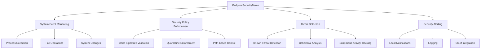

# EndpointSecurityDemo Documentation

  

Welcome to the official documentation for EndpointSecurityDemo, a comprehensive security monitoring and protection solution for macOS environments. This documentation provides enterprise-level guidance for deployment, configuration, and ongoing management.

## Executive Overview

EndpointSecurityDemo provides real-time system event monitoring and security policy enforcement by leveraging Apple's EndpointSecurity framework. It offers capabilities similar to and extending beyond macOS's built-in Gatekeeper and XProtect features, with extensive customization options for corporate environments.

## Key Features

- **Comprehensive Event Monitoring**: Track and analyze system events in real-time
- **Advanced Security Policies**: Enforce flexible, enterprise-grade security policies
- **Gatekeeper Enhancement**: Extend macOS Gatekeeper with customizable code signing policies
- **XProtect Enhancement**: Add behavioral analysis and custom threat detection
- **Performance Optimization**: Both serial and asynchronous processing modes for different environments
- **Enterprise Integration**: Deploy and manage at scale with MDM and SIEM integration

## Business Value

- **Risk Reduction**: Block execution of unauthorized or malicious software
- **Compliance Support**: Help meet regulatory requirements for endpoint security
- **Threat Intelligence**: Gain visibility into security-relevant system activity
- **Custom Protection**: Deploy security policies tailored to your organization's needs
- **Operational Efficiency**: Automate security responses to common threats

## Documentation Contents

- [[Architecture]] - Technical architecture and system design
- [[Setup Guide]] - Installation and initial configuration
- [[Deployment Guide]] - Enterprise deployment strategies
- [[Security Features]] - Detailed security capabilities
- [[Implementation Details]] - In-depth technical implementation
- [[API Reference]] - Framework interfaces and usage
- [[Best Practices]] - Recommendations for optimal deployment
- [[Troubleshooting]] - Problem resolution and support

## System Requirements

| Requirement | Details |
|-------------|---------|
| Operating System | macOS Catalina (10.15) or later |
| Development | Xcode 16 or later |
| Privileges | Administrative access for installation |
| Security | Special entitlements for EndpointSecurity access |
| Entitlement | com.apple.developer.endpoint-security.client |
| Disk Space | 50 MB minimum |
| Memory | 100 MB minimum |
| Processor | 64-bit Intel or Apple Silicon |

## Getting Started

1. Review the [[Architecture]] to understand the system design
2. Follow the [[Setup Guide]] to build and configure the application
3. Consult the [[Deployment Guide]] for enterprise deployment strategies
4. Implement [[Best Practices]] for optimal security and performance

## Support and Maintenance

EndpointSecurityDemo is provided under the MIT License. See LICENSE.txt for details.

For enterprise deployments, we recommend establishing:

- Regular update schedule for security signatures
- Monitoring process for application health
- Integration with your security operations workflow
- User training for security alert response

## Enterprise Resources

- [[Deployment Guide]] for full enterprise deployment instructions
- [[Best Practices]] for operational excellence
- [[Implementation Details]] for technical teams
- [[Troubleshooting]] for support teams

## Legal Notice

Copyright (c) 2024-2025 Anubhav Gain

This software is provided under the MIT License. Use of this software implies acceptance of all terms outlined in the LICENSE.txt file.
