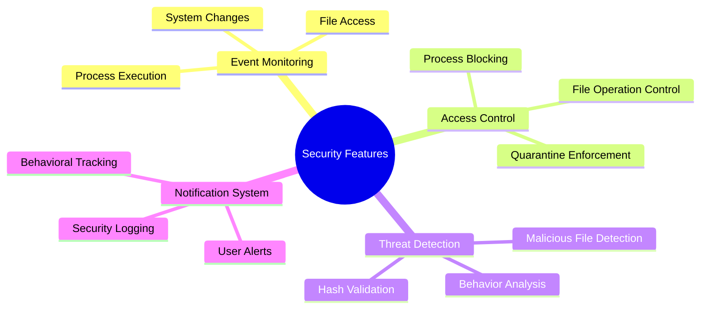
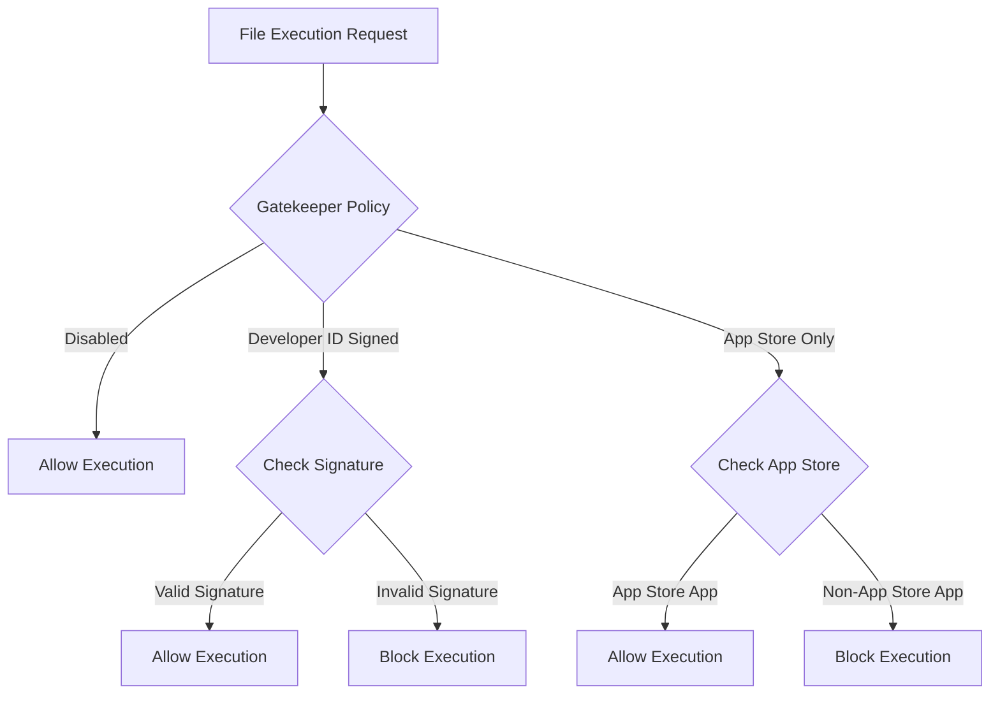
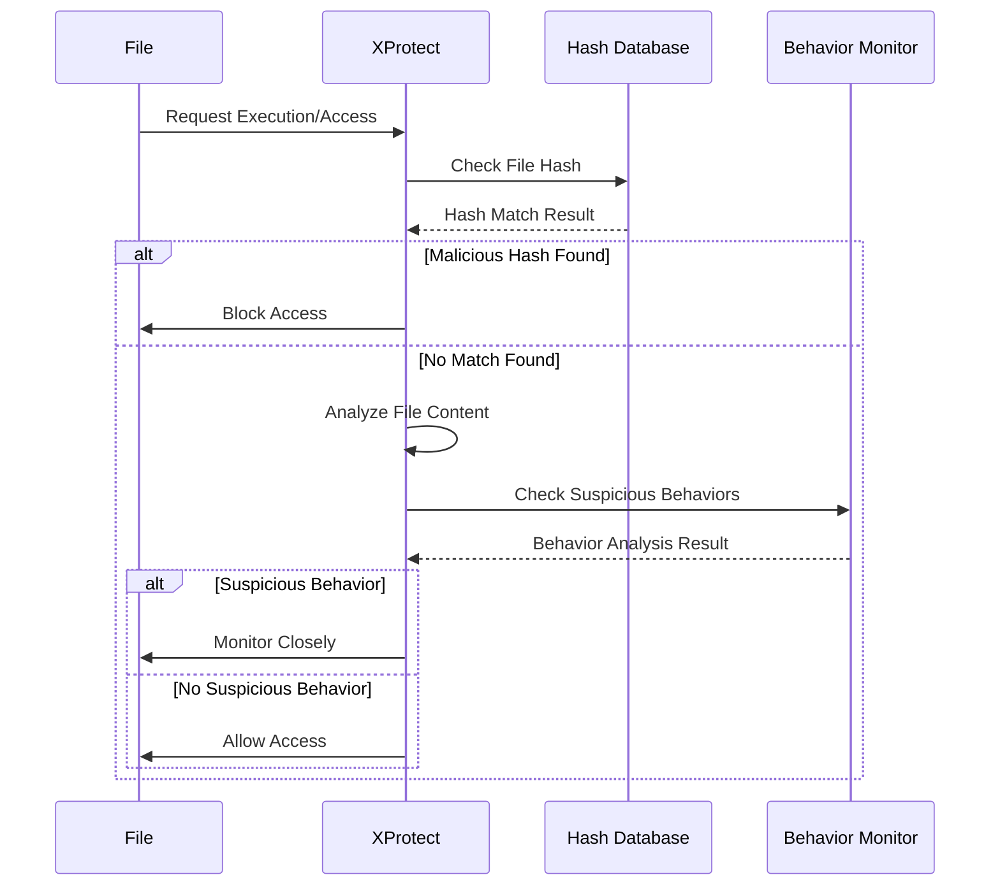
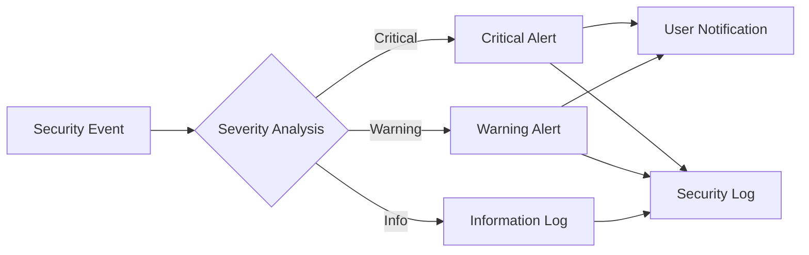

# Security Features

EndpointSecurityDemo implements a comprehensive set of security features that emulate and extend the capabilities of macOS built-in security systems like Gatekeeper and XProtect.

## Core Security Capabilities



## Gatekeeper Emulation

The Gatekeeper functionality ensures that only trusted applications can execute on the system.

### Policy Levels



### Key Features

1. **Code Signature Verification**
   - Validates digital signatures on executable files
   - Checks for valid Developer ID signatures
   - Verifies Apple platform binaries

2. **Notarization Checking**
   - Verifies that apps have been notarized by Apple
   - Enforces hardened runtime requirements
   - Provides path-based notarization policies

3. **Quarantine Awareness**
   - Identifies files downloaded from the internet
   - Applies stricter verification to quarantined files
   - Extracts quarantine metadata for security decisions

## XProtect Emulation

The XProtect functionality provides malware detection and prevention capabilities.

### Threat Detection Process



### Implementation Details

The XProtect emulation is implemented with the following key components:

```objectivec
// Threat level classification
typedef NS_ENUM(NSUInteger, ThreatLevel) {
    ThreatLevelNone = 0,
    ThreatLevelSuspicious = 1,
    ThreatLevelMalicious = 2
};

// Core detection functions
ThreatLevel analyze_file_threat_level(const char* path);
NSString* calculate_file_hash(const char* path);
bool has_suspicious_extension(const NSString* path);
void record_suspicious_behavior(const es_process_t* proc);
```

### Malware Detection Methodology

Our implementation uses a multi-layered approach:

1. **Hash-based Detection**: Compares SHA-256 hashes against known malicious file signatures
2. **Extension Analysis**: Monitors high-risk file extensions commonly associated with malware
3. **Behavioral Analysis**: Tracks suspicious activities with a threshold-based scoring system
4. **Sensitive Data Access Monitoring**: Watches for unauthorized access to critical system areas

## Security Notification System

The application includes a comprehensive notification system that alerts users to security events:



## Enhanced Security Policies

The application implements configurable security policies that can be customized for different environments:

1. **Execution Control Policies**
   - Block specific applications by path
   - Enforce code signing requirements
   - Control execution of scripts and interpreters

2. **File Access Policies**
   - Monitor access to sensitive files
   - Control which applications can access specific file types
   - Prevent unauthorized modifications to system files

3. **Behavioral Analysis Policies**
   - Set thresholds for suspicious behavior
   - Define actions to take when thresholds are exceeded
   - Configure notification settings for security events

## Corporate Deployment Considerations

When deploying EndpointSecurityDemo in a corporate environment, consider the following:

1. **Policy Configuration**
   - Create standardized policies appropriate for your security requirements
   - Consider different policy tiers for different user groups or device types
   - Document exceptions for approved applications

2. **Integration with SIEM**
   - Forward security events to your corporate SIEM solution
   - Establish alerting thresholds appropriate for your environment
   - Correlate events with other security telemetry

3. **Maintenance Requirements**
   - Regular updates to malware signature database
   - Periodic review of blocked application lists
   - Adjustments to detection thresholds based on false positive rates
