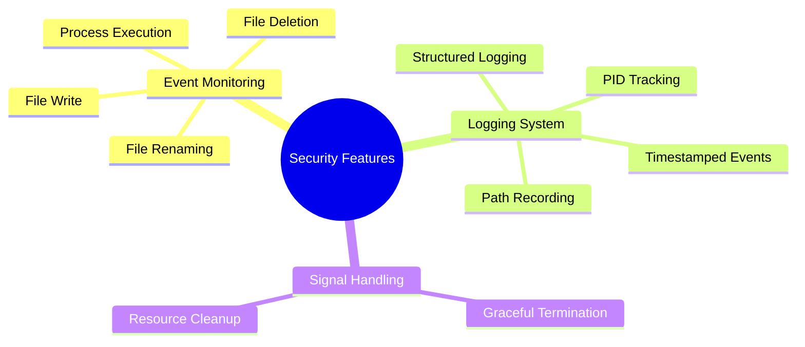
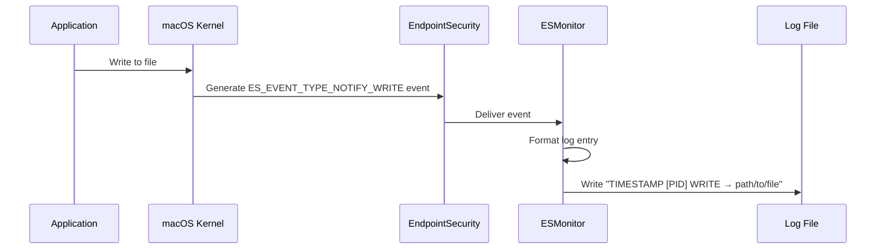

# Security Features

EndpointSecurityDemo implements a file monitoring system that tracks critical file system operations using Apple's EndpointSecurity framework.

## Core Security Capabilities



## Event Monitoring

The ESMonitor implementation monitors four critical system events:

### Process Execution Monitoring

```mermaid
graph TD
    A[Kernel] -->|Process Execution| B{EndpointSecurity}
    B -->|ES_EVENT_TYPE_NOTIFY_EXEC| C[ESMonitor]
    C -->|Log Entry| D[Log File]
    D --> E[Format: TIMESTAMP [PID] EXEC → path/to/executable]
```

Process execution monitoring captures when any process is started on the system, providing:
- The timestamp of execution
- The process ID (PID)
- The full path to the executed binary

### File Write Monitoring

File write monitoring captures file modifications:



### File Deletion Monitoring

File deletion monitoring captures when files are removed from the system:

- Event Type: `ES_EVENT_TYPE_NOTIFY_UNLINK`
- Log Format: `TIMESTAMP [PID] UNLINK → path/to/file`

### File Rename Monitoring

File rename monitoring captures when files are renamed, tracking both source and destination:

- Event Type: `ES_EVENT_TYPE_NOTIFY_RENAME`
- Log Format:
  - For existing destination: `TIMESTAMP [PID] RENAME → source_path → destination_path`
  - For new path: `TIMESTAMP [PID] RENAME → source_path → directory_path/filename`

## Logging System

The application implements a robust file-based logging system that ensures security events are properly recorded:

### Log File Security

- Default Path: `/var/log/es_monitor.log`
- Permissions: 644 (rw-r--r--)
- Requires root privileges to write (application must be run with sudo)

### Log Entry Structure

Each log entry contains:
1. ISO-8601 formatted timestamp with millisecond precision
2. Process ID (PID) of the process performing the action
3. Event type (EXEC, WRITE, UNLINK, RENAME)
4. Relevant file paths

Sample log entries:
```
2023-05-15 14:32:45.123 [PID 1234] EXEC → /usr/bin/ls
2023-05-15 14:32:46.456 [PID 1235] WRITE → /Users/username/document.txt
2023-05-15 14:32:47.789 [PID 1236] UNLINK → /Users/username/old_file.txt
2023-05-15 14:32:48.012 [PID 1237] RENAME → /Users/username/file.txt → /Users/username/renamed.txt
```

## Security Considerations

### Privilege Requirements

EndpointSecurityDemo requires:

1. **Root Privileges**: Must be run with sudo to:
   - Access the EndpointSecurity framework
   - Write to the log file location

2. **Special Entitlements**: Requires the com.apple.developer.endpoint-security.client entitlement:
   ```xml
   <key>com.apple.developer.endpoint-security.client</key>
   <true/>
   ```

3. **Full Disk Access**: The Terminal application running EndpointSecurityDemo must have Full Disk Access permission in System Preferences.

### Security Use Cases

The implementation supports several security use cases:

1. **File Integrity Monitoring**: Track modifications to critical system files
2. **Process Execution Auditing**: Monitor which applications are being launched
3. **Data Loss Prevention**: Detect file deletions and renames that might indicate data exfiltration
4. **Security Forensics**: Provide an audit trail of file system activity for incident response

## Graceful Termination

The application implements proper signal handling to ensure secure termination:

1. Captures SIGINT (Ctrl+C) signals
2. Properly unsubscribes from EndpointSecurity events
3. Closes the log file handle cleanly
4. Frees resources and terminates with success status
