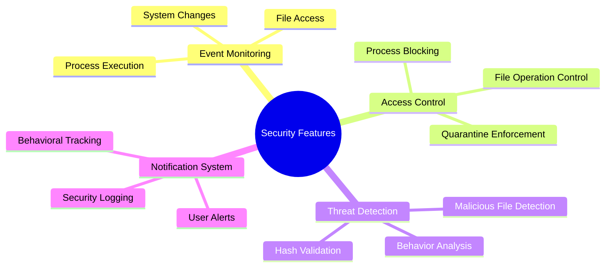
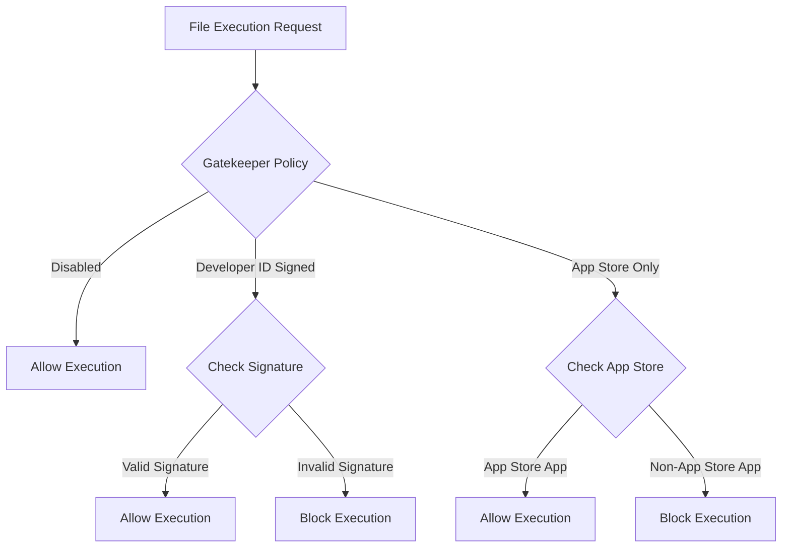
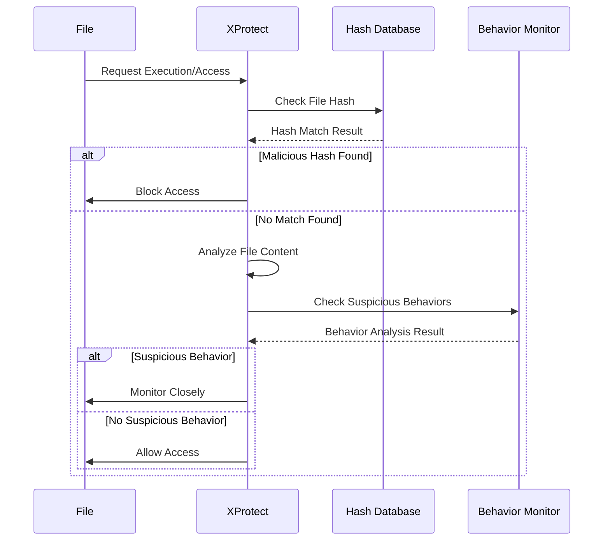
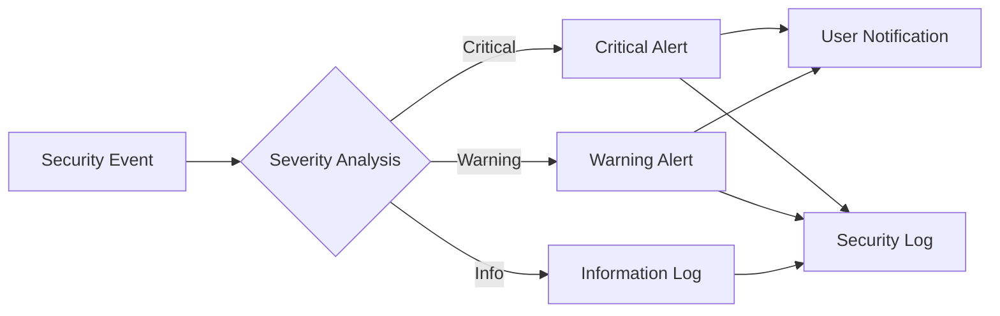

2# Security Features

EndpointSecurityDemo implements a comprehensive set of security features that emulate and extend the capabilities of macOS built-in security systems like Gatekeeper and XProtect.

## Core Security Capabilities

## Gatekeeper Emulation

The Gatekeeper functionality ensures that only trusted applications can execute on the system.

### Policy Levels

### Key Features

1. **Code Signature Verification**
   - Validates digital signatures on executable files
   - Checks for valid Developer ID signatures
   - Verifies Apple platform binaries

2. **Notarization Checking**
   - Verifies that apps have been notarized by Apple
   - Enforces hardened runtime requirements
   - Provides path-based notarization policies

3. **Quarantine Awareness**
   - Identifies files downloaded from the internet
   - Applies stricter verification to quarantined files
   - Extracts quarantine metadata for security decisions

## XProtect Emulation

The XProtect functionality provides malware detection and prevention capabilities.

### Threat Detection Process

### Key Features

1. **Malware Signature Database**
   - Maintains SHA-256 hashes of known malicious files
   - Blocks execution of files matching malicious signatures
   - Extensible database system for adding new threats

2. **Suspicious Behavior Monitoring**
   - Tracks suspicious activity by processes
   - Implements threshold-based detection system
   - Escalates security response based on behavior patterns

3. **Sensitive File Access Control**
   - Monitors access to critical system directories
   - Controls access to sensitive user data
   - Prevents potential data exfiltration

## Security Notification System

The application includes a comprehensive notification system that alerts users to security events:

## Enhanced Security Policies

The application implements configurable security policies that can be customized for different environments:

1. **Execution Control Policies**
   - Block specific applications by path
   - Enforce code signing requirements
   - Control execution of scripts and interpreters

2. **File Access Policies**
   - Monitor access to sensitive files
   - Control which applications can access specific file types
   - Prevent unauthorized modifications to system files

3. **Behavioral Analysis Policies**
   - Set thresholds for suspicious behavior
   - Define actions to take when thresholds are exceeded
   - Configure notification settings for security events
