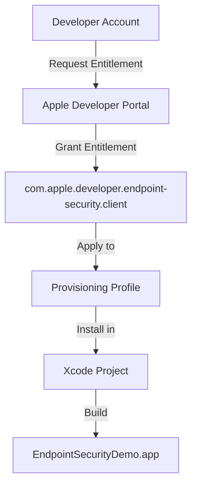
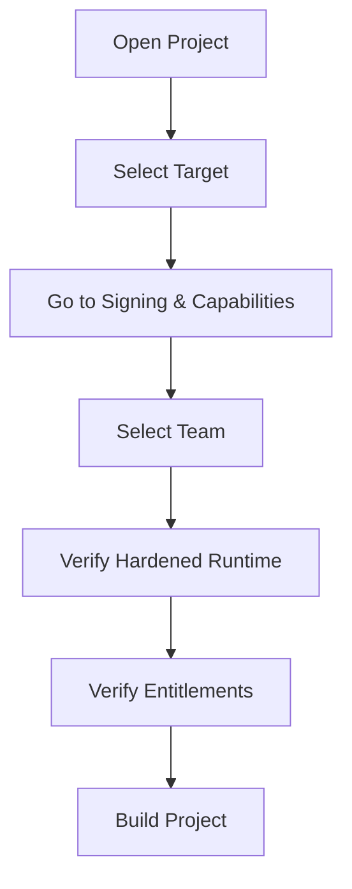

# Setup Guide

This guide provides detailed instructions for setting up and running the EndpointSecurityDemo application.

## Prerequisites

Before beginning the setup process, ensure you have the following:

- macOS Catalina 10.15 or later
- Xcode 12 or later
- An Apple Developer account with the ability to request special entitlements
- Administrative access to your macOS system

## Entitlement Requirements

EndpointSecurityDemo requires special entitlements from Apple to function properly:



### Obtaining the EndpointSecurity Entitlement

1. Log in to your [Apple Developer Account](https://developer.apple.com/account)
2. Request the `com.apple.developer.endpoint-security.client` entitlement by contacting Apple through: [Request System Extension](https://developer.apple.com/contact/request/system-extension/)
3. Provide justification for why your application needs this entitlement
4. Once approved, create a provisioning profile that includes this entitlement
5. Download and install the provisioning profile in your Xcode project

## Building the Project

### Step 1: Configure Xcode Project

1. Open the EndpointSecurityDemo.xcodeproj file in Xcode
2. In the project editor, select the "EndpointSecurityDemo" target
3. Go to the "Signing & Capabilities" tab
4. Select your Team from the dropdown
5. Ensure "Hardened Runtime" is enabled
6. Ensure the `com.apple.developer.endpoint-security.client` entitlement is present



### Step 2: Build the Project

1. Select the appropriate build configuration (Debug or Release)
2. Choose "My Mac" as the target device
3. Click the "Build" button or use Cmd+B
4. The build produces an app bundle in your build directory

## Running the Application

EndpointSecurityDemo must be run from Terminal with administrative privileges:

```bash
sudo ./EndpointSecurityDemo.app/Contents/MacOS/EndpointSecurityDemo
```

### System Permissions

The Terminal application must have Full Disk Access permission:

1. Open System Preferences
2. Go to Security & Privacy
3. Select the Privacy tab
4. Select Full Disk Access from the left panel
5. Click the lock icon to make changes (requires admin password)
6. Add Terminal.app to the list of allowed applications

## Log File Location

The application logs events to:

```
/var/log/es_monitor.log
```

You can view the log in real-time using:

```bash
sudo tail -f /var/log/es_monitor.log
```

## Verification

To verify that the application is running correctly:

1. Start the application with sudo
2. Execute a command in another terminal window, like `ls`
3. Check the log file for the corresponding EXEC event
4. Create, modify, and delete files to verify WRITE, UNLINK, and RENAME events

## Monitoring Events

The application monitors four types of events:

1. **EXEC**: Process execution
   - Example: `/bin/ls` being executed

2. **WRITE**: File write operations
   - Example: Saving a document in TextEdit

3. **UNLINK**: File deletion
   - Example: Moving a file to Trash or using `rm`

4. **RENAME**: File rename operations
   - Example: Renaming a file in Finder or using `mv`

## Termination

To stop the application, press Ctrl+C in the terminal where it's running. The application will:

1. Unsubscribe from EndpointSecurity events
2. Delete the EndpointSecurity client
3. Close the log file
4. Exit gracefully
