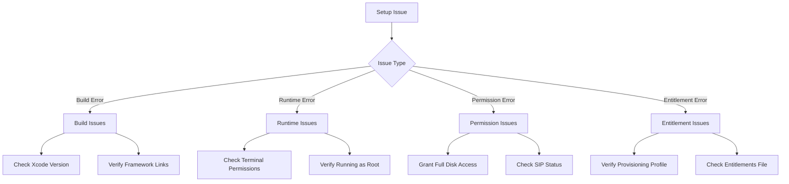

# Troubleshooting Guide

This document provides solutions for common issues encountered when setting up and running EndpointSecurityDemo.

## Common Issues

### Installation and Setup Issues



#### Issue: Application fails to build

**Possible Causes:**
- Missing framework references
- Invalid project settings
- Incorrect Xcode version

**Solutions:**
1. Ensure all required frameworks are linked:
   - libEndpointSecurity.tbd
   - libbsm.tbd
   - UniformTypeIdentifiers.framework (weak link)

2. Verify your Xcode version is 16 or later.

3. Check that the macOS deployment target is set to 10.15 or later.

#### Issue: "Application lacks required entitlement" error

**Possible Causes:**
- Missing com.apple.developer.endpoint-security.client entitlement
- Incorrect provisioning profile

**Solutions:**
1. Verify the entitlement is correctly added to your entitlements file:
   ```xml
   <key>com.apple.developer.endpoint-security.client</key>
   <true/>
   ```

2. Ensure you're using a provisioning profile that includes this entitlement.

3. Confirm your Apple Developer account has been granted this entitlement.

### Runtime Issues

#### Issue: "Application lacks Transparency, Consent, and Control (TCC) approval" error

**Possible Causes:**
- Terminal doesn't have Full Disk Access

**Solutions:**
1. Open System Preferences > Security & Privacy > Privacy > Full Disk Access
2. Add Terminal.app to the list of applications
3. Restart Terminal and try running the application again

#### Issue: "Application needs to be run as root" error

**Possible Causes:**
- Not running the application with sudo

**Solutions:**
1. Always run the application with sudo:
   ```bash
   sudo ./EndpointSecurityDemo.app/Contents/MacOS/EndpointSecurityDemo serial
   ```

#### Issue: Event messages being dropped by the kernel

**Possible Causes:**
- High volume of events
- Slow processing of events
- Insufficient resources

**Solutions:**
1. Use the asynchronous message handler for better performance:
   ```bash
   sudo ./EndpointSecurityDemo.app/Contents/MacOS/EndpointSecurityDemo asynchronous
   ```

2. Reduce the number of event types subscribed to.

3. Implement path muting for high-volume paths:
   ```objectivec
   es_mute_path(client, "/path/to/mute", ES_MUTE_PATH_TYPE_LITERAL);
   ```

### Security Policy Issues

#### Issue: Application is incorrectly blocking legitimate processes

**Possible Causes:**
- Overly restrictive security policies
- Path conflicts with system processes

**Solutions:**
1. Update the blocked paths list to exclude necessary system utilities:
   ```objectivec
   g_blocked_paths = [NSSet setWithObjects:
                     @"/path/to/block",
                     nil];
   ```

2. Modify the Gatekeeper policy level in the security preferences.

#### Issue: Malware detection generating false positives

**Possible Causes:**
- Suspicious extension list too broad
- Behavior thresholds too sensitive

**Solutions:**
1. Adjust the suspicious file extensions list:
   ```objectivec
   g_suspicious_extensions = [NSSet setWithObjects:
                            @"app", @"dylib", @"kext",
                            nil];
   ```

2. Increase the suspicious behavior threshold:
   ```objectivec
   #define SUSPICIOUS_BEHAVIOR_THRESHOLD 5  // Increased from 3
   ```

## Logging and Debugging

### Enabling Verbose Logging

To enable detailed logging for troubleshooting:

```bash
sudo ./EndpointSecurityDemo.app/Contents/MacOS/EndpointSecurityDemo serial verbose
```

### Checking Subscribed Events

To verify which events the application is subscribed to:

```objectivec
bool log_subscribed_events(void) {
    size_t count = 0;
    es_event_type_t *events = NULL;
    es_return_t result = es_subscriptions(g_client, &count, &events);

    if(ES_RETURN_SUCCESS != result) {
        LOG_ERROR("es_subscriptions: ES_RETURN_ERROR");
        return false;
    }

    LOG_IMPORTANT_INFO("Subscribed Events: %@", events_str(count, events));

    free(events);
    return true;
}
```

### Monitoring Dropped Events

The application automatically detects and logs dropped events. Look for messages like:

```
ERROR: EVENTS DROPPED! seq_num is ahead by: 5
```

or

```
ERROR: EVENTS DROPPED! global_seq_num is ahead by: 3
```

## Advanced Troubleshooting

### Running in SIP Disabled Environment

For testing purposes, you may need to run in a System Integrity Protection (SIP) disabled environment:

1. Restart your Mac in Recovery Mode (hold Command+R during startup)
2. Open Terminal and run: `csrutil disable`
3. Restart your Mac
4. After testing, re-enable SIP with: `csrutil enable`

**Warning:** Running with SIP disabled reduces system security. Only use this in testing environments.

### Debugging Process Behavior

To get more information about process behavior:

```bash
sudo fs_usage -f filesystem | grep [process_name]
```

### Inspecting Code Signing

To manually verify code signing status:

```bash
codesign -dvvv [path_to_binary]
```
