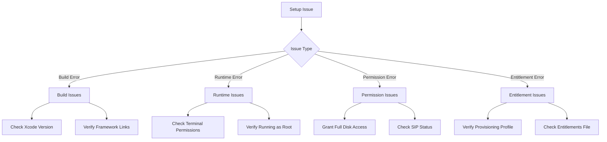

# Troubleshooting Guide

This document provides solutions for common issues encountered when setting up and running EndpointSecurityDemo.

## Common Issues

### Installation and Setup Issues



#### Issue: Application fails to build

**Possible Causes:**
- Missing framework references
- Invalid project settings
- Incorrect Xcode version

**Solutions:**
1. Ensure all required frameworks are linked:
   - EndpointSecurity.framework
   - libbsm.tbd

2. Verify your Xcode version is 12 or later.

3. Check that the macOS deployment target is set to 10.15 or later.

#### Issue: "Application lacks required entitlement" error

**Possible Causes:**
- Missing com.apple.developer.endpoint-security.client entitlement
- Incorrect provisioning profile

**Solutions:**
1. Verify the entitlement is correctly added to your entitlements file:
   ```xml
   <key>com.apple.developer.endpoint-security.client</key>
   <true/>
   ```

2. Ensure you're using a provisioning profile that includes this entitlement.

3. Confirm your Apple Developer account has been granted this entitlement.

### Runtime Issues

#### Issue: "Operation not permitted" when running the application

**Possible Causes:**
- Terminal doesn't have Full Disk Access
- Not running the application as root

**Solutions:**
1. Grant Terminal Full Disk Access:
   - Open System Preferences > Security & Privacy > Privacy > Full Disk Access
   - Add Terminal.app to the list of allowed applications
   - Restart Terminal

2. Run the application with sudo:
   ```bash
   sudo ./EndpointSecurityDemo.app/Contents/MacOS/EndpointSecurityDemo
   ```

#### Issue: "Could not create log file" error

**Possible Causes:**
- Insufficient permissions to write to /var/log
- Directory doesn't exist
- Disk space issues

**Solutions:**
1. Ensure you're running the application with sudo

2. Check permissions on the /var/log directory:
   ```bash
   ls -la /var/log
   ```

3. Verify available disk space:
   ```bash
   df -h
   ```

#### Issue: No events being logged

**Possible Causes:**
- EndpointSecurity client not initialized properly
- Event subscription failed
- Log file writing issues

**Solutions:**
1. Check if EndpointSecurityDemo is running:
   ```bash
   ps aux | grep EndpointSecurityDemo
   ```

2. Check the system log for EndpointSecurity errors:
   ```bash
   sudo log show --predicate 'subsystem == "com.apple.endpointsecurity"' --last 5m
   ```

3. Verify the log file exists and is writable:
   ```bash
   ls -la /var/log/es_monitor.log
   ```

## EndpointSecurity Specific Issues

### Issue: ES_NEW_CLIENT_RESULT_ERR_NOT_ENTITLED error

**Possible Causes:**
- Missing entitlement in the application binary
- Invalid code signature

**Solutions:**
1. Check the application's entitlements:
   ```bash
   codesign -d --entitlements :- /path/to/EndpointSecurityDemo.app
   ```

2. Verify the application is correctly signed:
   ```bash
   codesign -vvv /path/to/EndpointSecurityDemo.app
   ```

3. Re-sign the application with the correct entitlements:
   ```bash
   codesign --force --options runtime --sign "Developer ID Application: Your Name (TEAM_ID)" --entitlements /path/to/entitlements.plist /path/to/EndpointSecurityDemo.app
   ```

### Issue: ES_NEW_CLIENT_RESULT_ERR_NOT_PRIVILEGED error

**Possible Causes:**
- Application not running as root

**Solution:**
Always run the application with sudo:
```bash
sudo ./EndpointSecurityDemo.app/Contents/MacOS/EndpointSecurityDemo
```

### Issue: ES_NEW_CLIENT_RESULT_ERR_NOT_PERMITTED error

**Possible Causes:**
- Terminal lacks Full Disk Access
- TCC database issues

**Solutions:**
1. Grant Terminal Full Disk Access as described earlier

2. Reset the TCC database (caution: this will reset all privacy preferences):
   ```bash
   tccutil reset All
   ```

## Log File Issues

### Issue: Cannot view log file

**Possible Causes:**
- Insufficient permissions
- Log file not created

**Solutions:**
1. Use sudo to view the log:
   ```bash
   sudo cat /var/log/es_monitor.log
   ```

2. Monitor the log in real-time:
   ```bash
   sudo tail -f /var/log/es_monitor.log
   ```

### Issue: Log file growing too large

**Possible Causes:**
- Many events being logged over time
- No log rotation

**Solutions:**
1. Implement log rotation by adding a configuration to /etc/newsyslog.d/:
   ```
   # Create file: /etc/newsyslog.d/es_monitor.conf
   /var/log/es_monitor.log 644 10 1000 * JN
   ```

2. Manually rotate the log when needed:
   ```bash
   sudo mv /var/log/es_monitor.log /var/log/es_monitor.log.old
   sudo kill -HUP $(pgrep EndpointSecurityDemo)
   ```

## Advanced Troubleshooting

### Running in SIP Disabled Environment

For testing purposes, you may need to run in a System Integrity Protection (SIP) disabled environment:

1. Restart your Mac in Recovery Mode (hold Command+R during startup)
2. Open Terminal and run: `csrutil disable`
3. Restart your Mac
4. After testing, re-enable SIP with: `csrutil enable`

**Warning:** Running with SIP disabled reduces system security. Only use this in testing environments.

### Debugging Process Behavior

To get more information about the processes being monitored:

```bash
sudo fs_usage -f filesystem | grep [process_name]
```

### Checking Event Monitoring

To verify which events are being monitored by EndpointSecurity system-wide:

```bash
sudo log stream --predicate 'subsystem == "com.apple.endpointsecurity"' --level debug
```
